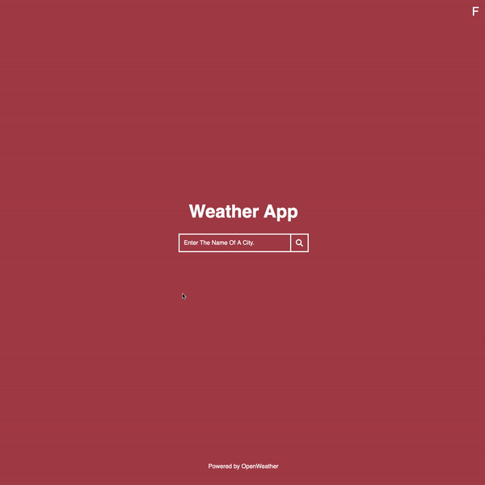

# Weather App

A responsive web page that allows users to search for weather results from [OpenWeather API](https://openweathermap.org/api). ☀️

# Motivation

It was my first time working with an API and I wanted to learn how to display information based on the results received. 👩🏻‍🏫

# Technologies Used

- Next.js
- Node.js
- OpenWeather API
- React
- Typescript

# Features

- Allows users to look up weather results based on a city name
- Implemented a switch to toggle between Fahrenheit and Celsius temperatures
- Displays error message when a city retrieves no results
